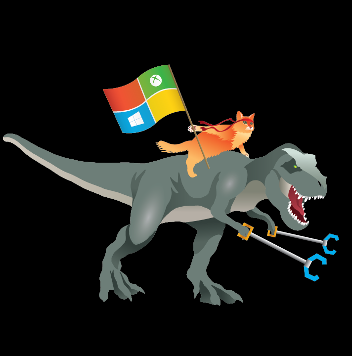

# Playground
A collection of things I have messed around with to learn, play, and sharpen my skillset

## Contents
* `/fetch-api` - experiments with the javascript fetch api
* `/skeleton-css-crash-course` - a quick rundown of the [Skeleton CSS framework](https://github.com/dhg/Skeleton)
* `/vuejs` - stuff I've built by following an awesome [course](https://www.udemy.com/course/vuejs-2-the-complete-guide/)!